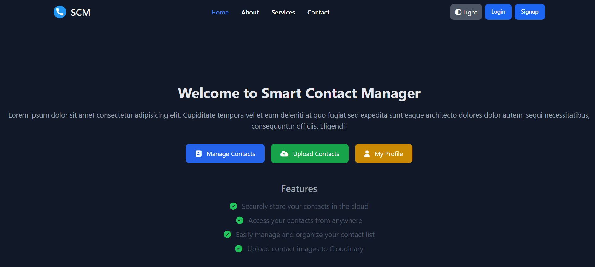

# Smart Contact Manager

<p align="center">
  
  
  

</p>

Welcome to **Smart Contact Manager**, a dynamic web application designed to help users manage their contacts with ease. With seamless authentication options, the ability to store contact images in the cloud, and a modern UI, Smart Contact Manager ensures a smooth user experience.

<p align="center">
  
</p>

## Table of Contents

- [Features](#features)
- [Technologies Used](#technologies-used)
- [Installation](#installation)
- [Usage](#usage)
- [Contributing](#contributing)
- [License](#license)
- [Contact](#contact)

## Features

- **User Registration and Authentication**:
    - Email verification for new users.
    - OAuth login via Google and GitHub.
    - Direct email login support.

- **Contact Management**:
    - Add, edit, and delete contacts with details such as name, email, phone number, and profile image.
    - Cloud-based image storage using Cloudinary.

- **Search Functionality**:
    - Advanced search by name, email, or phone number.

- **Responsive User Interface**:
    - Display contacts in an easy-to-view modal format.
    - Fully responsive design for optimal user experience on mobile, tablet, and desktop devices.

## Technologies Used

- **Backend**: Spring Boot, Spring Security, JPA/Hibernate, OAuth2
- **Frontend**: Thymeleaf, Tailwind CSS, React.js
- **Database**: MySQL
- **Authentication**: JWT, OAuth (Google and GitHub)
- **Image Storage**: Cloudinary
- **Email Service**: Spring Email
- **Logging**: SLF4J

## Installation

### Prerequisites

- Node.js
- npm
- Java JDK
- Maven
- MySQL

### Backend Setup

1. **Clone the repository**:
    ```bash
    git clone https://github.com/your-username/smart-contact-manager.git
    cd smart-contact-manager
    ```

2. **Configure MySQL database**:
    ```bash
    CREATE DATABASE smart_contact_manager;
    ```

3. **Update application.yml** with your MySQL credentials and other environment variables:
    ```yaml
    spring.datasource.url=jdbc:mysql://localhost:3306/smart_contact_manager
    spring.datasource.username=your_mysql_username
    spring.datasource.password=your_mysql_password
    spring.jpa.hibernate.ddl-auto=update
    spring.jpa.show-sql=true
    spring.jpa.properties.hibernate.dialect=org.hibernate.dialect.MySQL5Dialect
    spring.security.oauth2.client.registration.google.clientname=your_google_client_name
    cloudinary:
      cloud_name=your_cloud_name
      api_key=your_api_key
      api_secret=your_api_secret
    ```

4. **Run the Spring Boot application**:
    ```bash
    mvn spring-boot:run
    ```

### Frontend Setup

1. **Navigate to the client directory**:
    ```bash
    cd client
    ```

2. **Install dependencies**:
    ```bash
    npm install
    ```

3. **Start the React.js application**:
    ```bash
    npm start
    ```

### Usage

1. **Access the Application**: Open your browser and navigate to [http://localhost:3000](http://localhost:3000).
2. **Register or Login**: Create an account via email verification or log in using Google/GitHub.
3. **Manage Contacts**: Add, edit, and delete contacts. Search for contacts by name, email, or phone.
4. **Image Uploads**: Upload contact images, which are stored in Cloudinary.

## Contributing

We welcome contributions to the Smart Contact Manager project! Follow these steps to contribute:

1. **Fork the repository**.
2. **Create a new branch**:
    ```bash
    git checkout -b feature/your-feature
    ```
3. **Commit your changes**:
    ```bash
    git commit -m 'Add new feature'
    ```
4. **Push to the branch**:
    ```bash
    git push origin feature/your-feature
    ```
5. **Create a pull request** and we’ll review your changes.

## License

This project is licensed under the MIT License. See the [LICENSE](LICENSE) file for more details.

## Contact

For any inquiries or feedback, please contact us at:

- **Email**: piyushanand2580@gmail.com
- **GitHub**: [Piyush Singh](https://github.com/anandpiyush1521)

---

Thank you for using **Smart Contact Manager**! We hope you enjoy managing your contacts with ease.
